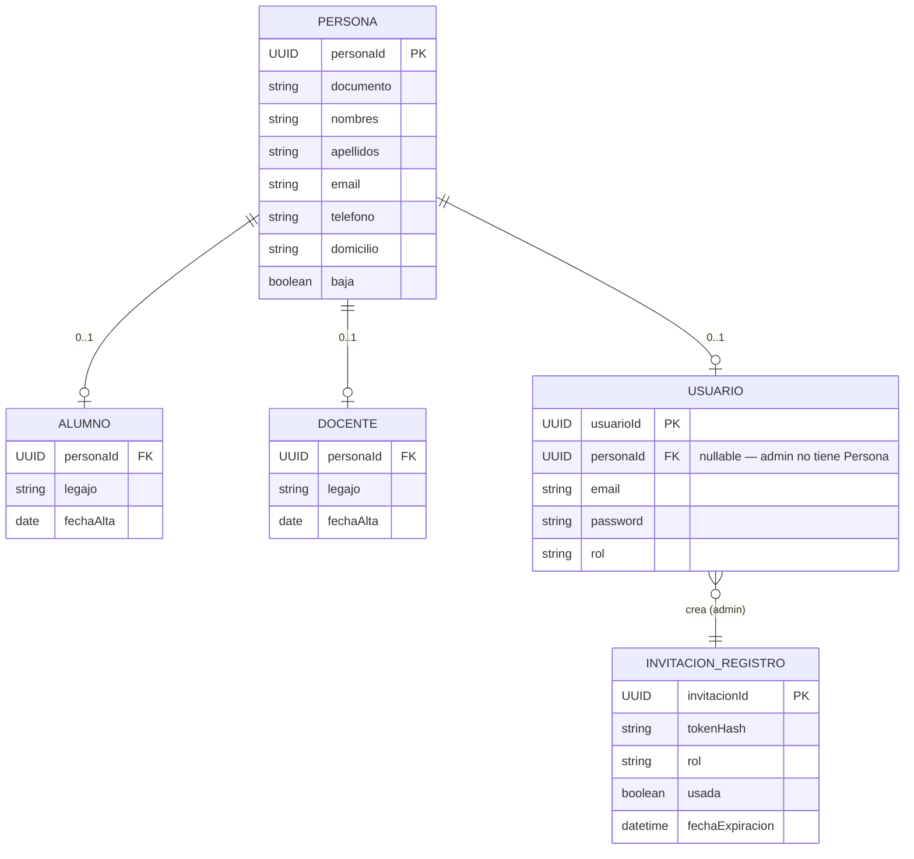
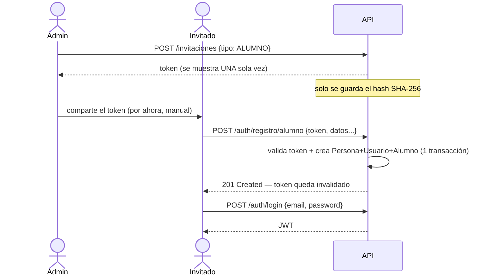

<div align="center">

# 🎓 ALMS — Academic Learning Management System

**Backend de un sistema de gestión de alumnos**, con autenticación JWT y alta por invitación.


</div>

---

## 📋 Tabla de contenidos

- [✨ Características](#-características)
- [🏗️ Stack y convenciones](#️-stack-y-convenciones)
- [📊 Modelo de datos](#-modelo-de-datos)
- [🔐 Autenticación y alta por invitación](#-autenticación-y-alta-por-invitación)
- [📡 Endpoints](#-endpoints)
- [🚀 Cómo correrlo localmente](#-cómo-correrlo-localmente)
- [🧪 Testing](#-testing)
- [☁️ Despliegue](#️-despliegue)
- [🗺️ Roadmap](#️-roadmap)

---

## ✨ Características

- 🔑 Autenticación **JWT** con Spring Security
- ✉️ Alta de Alumno/Docente **por invitación de un solo uso** (no hay registro abierto)
- 🧩 `Alumno`/`Docente` como **composición sobre `Persona`** (no herencia JPA) — una misma persona puede tener ambos roles a la vez
- 🗑️ Borrado lógico centralizado en `Persona`
- ✅ Cobertura de test en 4 capas: repositorio, servicio, controlador e integración end-to-end

---

## 🏗️ Stack y convenciones

| | |
|---|---|
| **Lenguaje** | Java 17 |
| **Framework** | Spring Boot 4.1.0 (Maven) |
| **Base de datos** | PostgreSQL (prod, vía [Supabase](https://supabase.com)) · H2 in-memory (tests) |
| **Seguridad** | Spring Security + JWT ([jjwt](https://github.com/jwtk/jjwt) 0.12.x) |
| **Despliegue** | [Render](https://render.com) |

**Convenciones del código:**

- 📦 Paquete base: `com.algz.alms`
- 🇦🇷 Nomenclatura **en español** consistente: `Servicio`, `Repositorio`, `Controlador`, `registro`, etc.
- 🧱 Arquitectura en capas: `Controlador → Servicio → Repositorio`
- 🆔 `UUID` como PK en todas las entidades (`@UuidGenerator`)
- 🗑️ **Borrado lógico** vive únicamente en `Persona` (campo `baja`) — dar de baja a una Persona da de baja automáticamente cualquier `Alumno`/`Docente` asociado, no hay campo `baja` duplicado en esas tablas.

---

## 📊 Modelo de datos

`Alumno` y `Docente` **no heredan** de `Persona` vía `@Inheritance`. Comparten la clave primaria con `Persona` mediante `@MapsId`, lo que permite que **una misma Persona sea Alumno y Docente a la vez** (ej. un ex-alumno que ahora es ayudante de cátedra) — algo que la herencia JPA no modela bien.



> 🚧 **Pendiente**: `carrera` (Alumno) y `especialidad`/cátedras (Docente) no son campos propios todavía — se resuelven más adelante con tablas relacionadas (`InscripcionCarrera`, `DocenteAsignatura`), permitiendo que un alumno tenga cero o varias inscripciones.

`legajo` se genera automáticamente en el servidor al registrarse (`AL-YYYY-NNNN` / `DO-YYYY-NNNN`) — nunca lo manda el cliente.

`Usuario.rol` se persiste como texto (`@Enumerated(EnumType.STRING)`), no como número — así reordenar el enum no rompe datos ya guardados.

---

## 🔐 Autenticación y alta por invitación

**No hay registro abierto.** El alta de Alumno/Docente requiere una invitación de un solo uso generada por un admin:



- 🔒 El token se guarda **hasheado** (SHA-256) — nunca en texto plano, mismo principio que una contraseña.
- ⏳ Expira a las **24 horas** por defecto (`invitacion.horas-validez`).
- 🔁 Un lock pesimista (`SELECT ... FOR UPDATE`) evita que dos requests casi simultáneas con el mismo token pasen ambas la validación.
- ❌ Un admin puede revocar una invitación vigente antes de que se use (`PATCH /invitaciones/{id}/revocar`).
- 🙅 El registro **no autentica automáticamente** — login queda como paso aparte.

---

## 📡 Endpoints

<details>
<summary><strong>🔑 Auth — <code>/api/v1/auth</code></strong></summary>

| Método | Endpoint | Auth | Descripción |
|---|---|---|---|
| `POST` | `/login` | No | Devuelve JWT |
| `POST` | `/registro/alumno` | No *(token de invitación)* | Alta de Persona + Usuario + Alumno |
| `POST` | `/registro/docente` | No *(token de invitación)* | Alta de Persona + Usuario + Docente |

</details>

<details>
<summary><strong>✉️ Invitaciones — <code>/api/v1/invitaciones</code></strong></summary>

| Método | Endpoint | Auth | Descripción |
|---|---|---|---|
| `POST` | `/` | `ROLE_ADMIN` | Genera un token de invitación |
| `PATCH` | `/{id}/revocar` | `ROLE_ADMIN` | Invalida una invitación vigente |

</details>

<details>
<summary><strong>👤 Personas — <code>/api/v1/personas</code></strong></summary>

| Método | Endpoint | Auth | Descripción |
|---|---|---|---|
| `GET` | `/` | Autenticado | Lista personas activas |
| `GET` | `/{id}` | Autenticado | Detalle de una persona |
| `POST` | `/` | Autenticado | Alta directa de Persona (sin Usuario) |
| `PUT` | `/{id}` | Autenticado | Actualiza datos de una persona |
| `PATCH` | `/{id}/baja` | Autenticado | Baja lógica (afecta también su Alumno/Docente) |

</details>

<details>
<summary><strong>🎓 Alumnos / 👨‍🏫 Docentes</strong></summary>

| Método | Endpoint | Auth | Descripción |
|---|---|---|---|
| `GET` | `/api/v1/alumnos` | Autenticado | Lista alumnos activos |
| `GET` | `/api/v1/alumnos/{id}` | Autenticado | Detalle de un alumno |
| `GET` | `/api/v1/docentes` | Autenticado | Lista docentes activos |
| `GET` | `/api/v1/docentes/{id}` | Autenticado | Detalle de un docente |

</details>

> ⚠️ **Pendiente de diseño**: salvo `/invitaciones`, ningún endpoint restringe por rol todavía — cualquier `Usuario` autenticado (alumno, docente o admin) accede a todos ellos.

📄 Ejemplos completos de request/response (`curl`) para cada endpoint: [`docs/pruebas-endpoints.md`](./docs/pruebas-endpoints.md)

---

## 🚀 Cómo correrlo localmente

**Requisitos:** Java 17 · PostgreSQL local (opcional si solo vas a correr tests, que usan H2)

Creá `src/main/resources/application-local.properties` (gitignored):

```properties
spring.datasource.url=jdbc:postgresql://localhost:5432/alms_db
spring.datasource.username=postgres
spring.datasource.password=<tu-password>

spring.jpa.hibernate.ddl-auto=update
spring.jpa.show-sql=true

server.port=8080

jwt.secret=<una-clave-larga-random>
jwt.expiration-ms=86400000

admin.nombre=Administrador
admin.email=admin@alms.local
admin.password=<una-contraseña-para-desarrollo>

invitacion.horas-validez=24
```

```bash
./mvnw spring-boot:run -Dspring-boot.run.profiles=local
```

Al arrancar, `AdminSeeder` crea automáticamente un `Usuario` con `ROLE_ADMIN` (idempotente: si ya existe uno, no crea otro).

---

## 🧪 Testing

Cuatro capas de test por módulo:

| Tipo | Anotación | Qué cubre |
|---|---|---|
| 1️⃣ | `@DataJpaTest` | Repositorio (H2 in-memory) |
| 2️⃣ | Mockito | Servicio (unitario) |
| 3️⃣ | `@WebMvcTest` | Slice de controlador |
| 4️⃣ | `@SpringBootTest` | Integración end-to-end (contexto completo, seguridad real) |

```bash
./mvnw clean test                                    # suite completa
./mvnw clean test -Dtest=NombreDeClase                # una sola clase
./mvnw clean test -Dtest=NombreDeClase#nombreDeTest    # un solo método
```

> 💡 Usá siempre `clean test` (no solo `test`) al depurar algo puntual — descarta bytecode desactualizado como fuente de errores fantasma.

<details>
<summary>⚠️ <strong>Gotchas de Spring Boot 4.1 con los tests</strong> (click para expandir)</summary>

<br>

Boot 4.1 modularizó varias anotaciones de test que antes venían en `spring-boot-starter-test`:

- `@DataJpaTest` → paquete `org.springframework.boot.data.jpa.test.autoconfigure`, requiere `spring-boot-starter-data-jpa-test`.
- `@WebMvcTest` / `@AutoConfigureMockMvc` → paquete `org.springframework.boot.webmvc.test.autoconfigure`, requiere `spring-boot-starter-webmvc-test`.
- `@MockBean` fue **eliminado** (no deprecado) → usar `@MockitoBean` de `org.springframework.test.context.bean.override.mockito`.
- `@WebMvcTest` escanea automáticamente cualquier bean `Filter` (incluido `JwtAuthenticationFilter`), sin importar `addFilters = false`. Hay que excluirlo explícitamente:
  ```java
  @WebMvcTest(
      controllers = MiControlador.class,
      excludeFilters = @ComponentScan.Filter(type = FilterType.ASSIGNABLE_TYPE, classes = JwtAuthenticationFilter.class)
  )
  ```
- Sin `AuthenticationEntryPoint` configurado, un request sin autenticar a un endpoint protegido devuelve **403**, no 401.

</details>

---

## ☁️ Despliegue

- **App**: Render
- **Base de datos**: Supabase (PostgreSQL administrado)

**Variables de entorno en Render:**

| Variable | Descripción |
|---|---|
| `DB_HOST`, `DB_PORT`, `DB_NAME`, `DB_USER`, `DB_PASSWORD` | Conexión a Supabase |
| `JWT_SECRET` | Clave de firma de los JWT |
| `JWT_EXPIRATION_MS` | Vigencia del JWT en ms |
| `ADMIN_NOMBRE`, `ADMIN_EMAIL`, `ADMIN_PASSWORD` | Credenciales del admin sembrado al arrancar |
| `INVITACION_HORAS_VALIDEZ` | Vigencia de los links de invitación (default 24) |
| `PORT` | Puerto asignado dinámicamente por Render |


---

## 🗺️ Roadmap

- [ ] `Carrera`, `PlanEstudio`, `Asignatura`, `Modulo`, `AsignaturaCorrelativa`
- [ ] `InscripcionCarrera` (Alumno ↔ Carrera, cero o varias por alumno)
- [ ] `DocenteAsignatura` (Docente ↔ Asignatura/cátedra)
- [ ] `MesaExamen`, `InscripcionMesaExamen`, `InscripcionAsignatura`
- [ ] Autorización por rol más fina en `Persona`/`Alumno`/`Docente`
- [ ] Flujo para agregar un rol nuevo a una `Persona` ya existente
- [ ] Envío real de invitaciones por email
- [ ] Migración de `ddl-auto=update` a Flyway/Liquibase

---

<div align="center">

Hecho con ☕ y Spring Boot — proyecto en desarrollo activo

</div>
